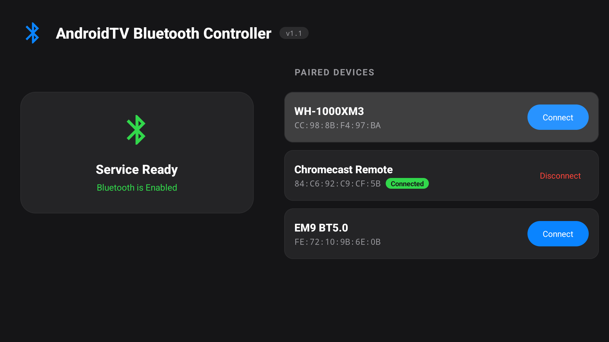

# AndroidTV Bluetooth Controller



A lightweight utility for Android TV that gives you a **1-click UI** to connect/disconnect Bluetooth devices, or complete **ADB automation** support.

## Features

- **1-Click Connect:** Simple UI to instantly toggle connections from your TV.
- **ADB Automation:** Trigger connections/disconnections via terminal or automation scripts (Tasker, Home Assistant).
- **Recent Sorting:** Automatically sorts paired devices by most recently used.
- **Low Overhead:** Minimal impact on system resources and stays ready across restarts.

## Usage

### UI Method
Simply launch the **AndroidTV Bluetooth Controller** app. All your paired devices will appear in a list. Click any device to connect or disconnect. Your most recently used devices will automatically stay at the top.

### ADB Method (Automation)
Connect or disconnect your Bluetooth devices by sending broadcast intents. This is perfect for mapping to remote buttons (via Button Mapper) or integrating into "Movie Mode" scenes.

### Connect a Device

**By Name (Recommended):**
```bash
adb shell am broadcast -a com.saihgupr.btcontrol.ACTION_CONNECT \
  -n com.saihgupr.btcontrol/.BluetoothControlReceiver \
  -e name "Your Device Name"
```
*Note: Name matching is case-insensitive (e.g., "LE_WH-1000XM4").*

**By MAC Address:**
```bash
adb shell am broadcast -a com.saihgupr.btcontrol.ACTION_CONNECT \
  -n com.saihgupr.btcontrol/.BluetoothControlReceiver \
  -e address "CC:98:8B:F4:97:BA"
```

### Disconnect a Device

```bash
adb shell am broadcast -a com.saihgupr.btcontrol.ACTION_DISCONNECT \
  -n com.saihgupr.btcontrol/.BluetoothControlReceiver \
  -e name "Your Device Name"
```

## Installation

### 1. Download & Install APK
Download the latest APK from the [Releases](https://github.com/saihgupr/AndroidTVBluetooth/releases) page and install it:
```bash
adb install -r path/to/AndroidTVBluetooth.apk
```

### 2. Grant Permissions
Required for Android 12+ (Android TV):
```bash
adb shell pm grant com.saihgupr.btcontrol android.permission.BLUETOOTH_CONNECT
```

### 3. Initialize
Launch the **AndroidTVBluetooth** app manually on your TV **one time** to move it out of the system's "stopped" state. You can close it immediately after.

---

### Alternative: Build from Source
If you prefer to build it yourself:
```bash
./gradlew assembleDebug
adb install -r app/build/outputs/apk/debug/AndroidTVBluetooth.apk
```

## Troubleshooting

If connection fails, check `logcat` to see which devices the TV detects:
```bash
adb logcat -d | grep "BtManagerHelper"
```
This will print a list of paired devices if your specified name was not found.

---

## Support the Project
This project is open-source and free. If you find it useful, consider giving it a star ⭐ or making a [donation](https://ko-fi.com/saihgupr) to support development.